# Adaptador NES para Geniecom (DB9/DE9)

Documentação da pinagem do controle do Geniecom, um Famiclone vendido no Brasil, e projeto de um adaptador para usar controles de NES (inclusive o 8BitDo Retro Receiver) nele.

## Sumário

- [Objetivo](#objetivo)
- [Referências](#referências)
- [Pinagem](#pinagem)
- [Terminologia](#terminologia)
- [Correlação Geniecom ↔ NES](#correlação-geniecom--nes)
- [Montando o adaptador](#montando-o-adaptador)
- [PCB (Gerber)](#pcb-gerber)
- [Bônus: outros clones](#bônus-outros-clones)
- [Estrutura do repositório](#estrutura-do-repositório)
- [Créditos](#créditos)
- [Licença](#licença)

## Objetivo

Recuperar a memória deste simpático Famiclone e documentar a pinagem do joystick dele. O objetivo prático é usar o [8BitDo Retro Receiver](https://www.8bitdo.com/retro-receiver-nes/) no Geniecom, jogando com controles sem fio como já faço no NES. Para isso, é preciso conhecer o mapa de pinagem do Geniecom e ligar o conector DB9/DE9 dele ao conector de 7 pinos do NES.

Para saber mais sobre o console, veja [este artigo no Bojoga](https://bojoga.com.br/acervo/consoles-de-mesa/geracao-3/geniecom/). A história completa do projeto está em [docs/historia.md](docs/historia.md).

## Referências

- O NES usa um [conector de 7 pinos](https://www.nesdev.org/wiki/Controller_port_pinout).
- O Geniecom usa o conector DB9/DE9. [Saiba mais sobre ele aqui](http://www.nullmodem.com/DB-9.htm).
- Vídeo de referência de um adaptador semelhante, do [canal do Cirne](https://youtu.be/fYj5p7F7-cc):

  [](https://youtu.be/fYj5p7F7-cc)

- Se você tem um Phantom System, Top Game, Geniecom ou Turbo Game, o Lucas Guilherme vende adaptadores prontos. [Confira aqui](https://shopee.com.br/shop/353762657).

## Pinagem

### Geniecom, visto pelo lado do controle

Perspectiva de quem olha o conector pelo lado do controle: o pino 5 fica à esquerda e o pino 1 à direita.

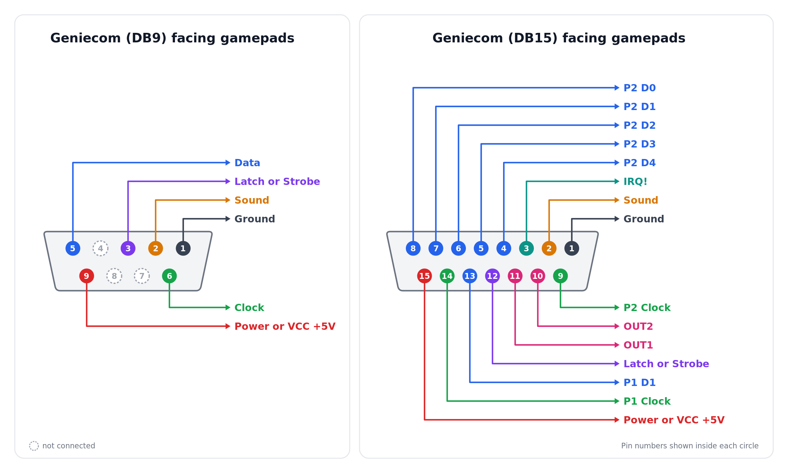

### Geniecom, visto pelo lado do console

Perspectiva de quem olha o conector do console de frente: o pino 1 fica à esquerda e o pino 5 à direita.

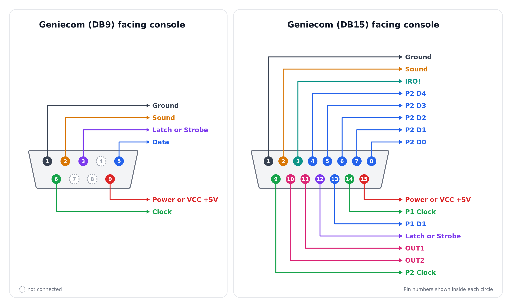

### Famicom e Geniecom (porta DB15)

A pinagem da porta DB15 do Geniecom segue o mesmo padrão do Famicom. A Light Gun do Famicom funciona no Geniecom (testado e confirmado). Com um [adaptador Famicom → NES](https://misteraddons.com/products/nes-controllers-to-famicom-console-adapter), consegui conectar dois controles de NES e uma [Zapper](https://en.wikipedia.org/wiki/NES_Zapper) ao Geniecom.

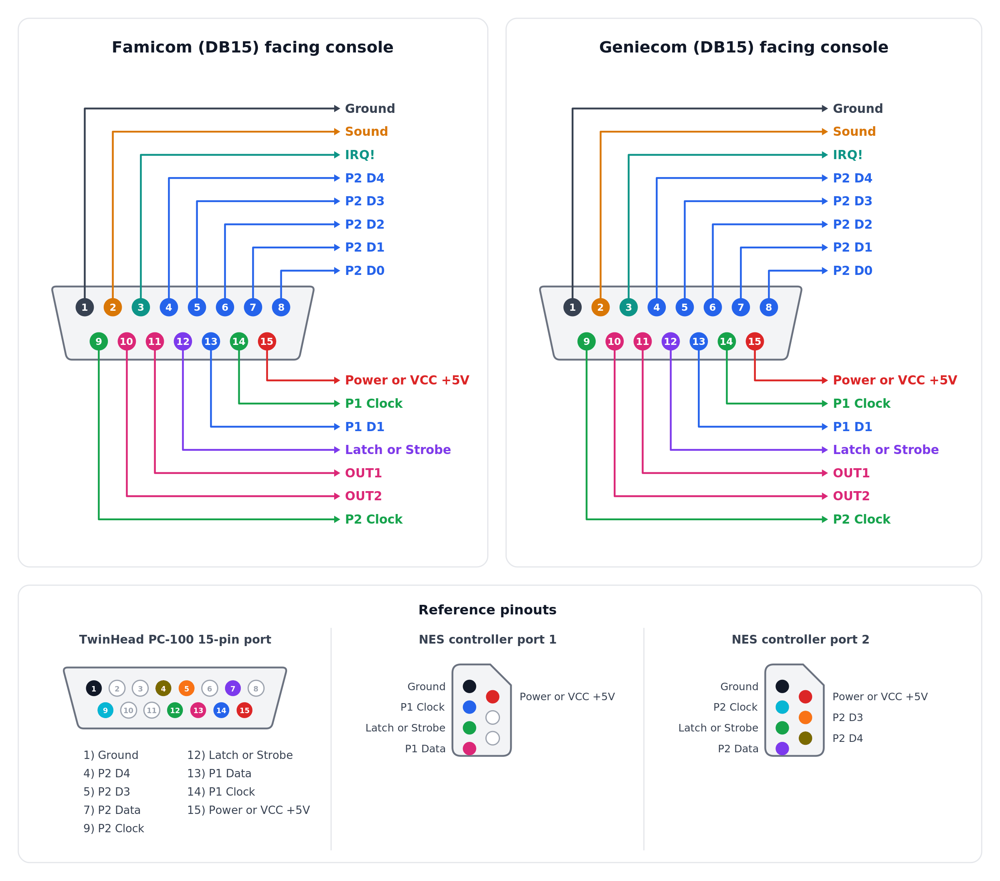

### NES

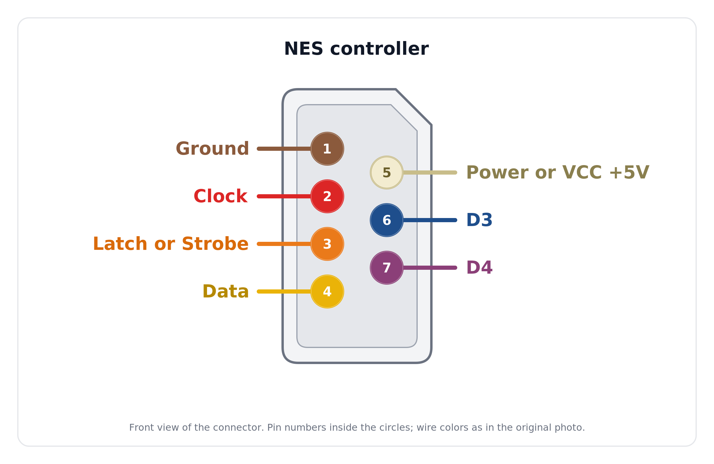

### Famicom (DB15) e portas do NES

Ligação entre a porta DB15 no padrão Famicom (exemplo: TwinHead PC-100) e as portas de controle 1 e 2 do NES. Os fios de Ground, Power e Latch são compartilhados pelas duas portas.

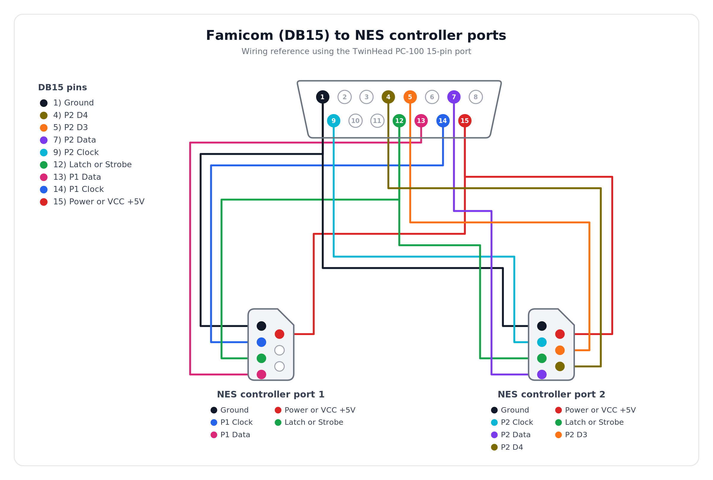

## Terminologia

- **Latch** e **Strobe** são o mesmo sinal. Nos diagramas e tabelas, aparece como "Latch or Strobe".
- **Power** e **VCC +5V** são a mesma alimentação de 5 V. Aparece como "Power or VCC +5V".
- **Ground** é o terra (GND).

## Correlação Geniecom ↔ NES

Para ligar um controle de NES ao Geniecom, cada função do DB9 do Geniecom vai para o pino de mesma função no conector do NES. Os números do DB9 abaixo são os pinos físicos do conector, como nos diagramas de pinagem acima.

| Função | Pino do DB9 (Geniecom) | Pino do NES |
| --- | --- | --- |
| Ground | 1 | 1 |
| Sound | 2 | Não usado (o NES não tem essa função) |
| Latch or Strobe | 3 | 3 |
| Data | 5 | 4 |
| Clock | 6 | 2 |
| Power or VCC +5V | 9 | 5 |
| Sem função | 4, 7 e 8 | 6 e 7 (D3 e D4, usados pela Zapper; não ligados) |

Fontes: os diagramas de pinagem do Geniecom acima e a [pinagem da porta de controle do NES](https://www.nesdev.org/wiki/Controller_port_pinout). Esta correlação vale tanto para o cabo adaptador quanto para a [PCB](#pcb-gerber).

## Montando o adaptador

> **Atenção:** o Geniecom e o NES alimentam o controle com +5 V no pino de Power. Antes de ligar um controle ou adaptador ao console, confirme com um multímetro (modo continuidade, com tudo desligado) que o fio de Power vai ao pino 9 do DB9 e ao pino 5 do NES, e que o Ground não está em curto com o Power. Uma inversão de polaridade pode queimar o controle, o Retro Receiver ou o console.

Os conectores DB9/DE9 machos do Geniecom são muito longos. Por isso, o conector fêmea também precisa ser longo o bastante para a conexão ficar firme, sem folgas. Para fazer o adaptador, comprei:

- [Cabo extensor para controle de Mega Drive](https://www.aliexpress.com/item/4000095438635.html)
- [Cabo extensor para controle de NES](https://www.aliexpress.com/item/4000029468234.html)
- [Anel de ferrite para cabo, 5 mm](https://www.aliexpress.com/item/1005006071819843.html)

Cortei os cabos dos dois extensores e mapeei cada pino do DB9 do cabo do Mega Drive para a função correspondente no Geniecom, e cada pino do cabo do NES para a sua função. As cores variam conforme o fabricante do cabo, então confirme com um multímetro antes de soldar.

### Cabo do Mega Drive (DB9, funções do Geniecom)

| Pino | Cor do fio | Função |
| --- | --- | --- |
| 01 | Vermelho | Ground |
| 02 | Preto | Sound |
| 03 | Cinza | Latch or Strobe |
| 04 | Laranja | Não usado |
| 05 | Marrom | Data |
| 06 | Verde | Clock |
| 07 | Branco | Não usado |
| 08 | Azul | Não usado |
| 09 | Amarelo | Power or VCC +5V |

### Cabo do NES (conector de 7 pinos)

| Pino | Cor do fio | Função |
| --- | --- | --- |
| 01 | Branco | Ground |
| 02 | Verde | Clock |
| 03 | Amarelo | Latch or Strobe |
| 04 | Preto | Data |
| 05 | Vermelho | Power or VCC +5V |
| 06 | Não usado | Não usado |
| 07 | Não usado | Não usado |

### Emenda dos fios

Os fios de mesma função dos dois cabos são ligados entre si. Com as cores dos cabos que usei:

| Função | Fio do Mega Drive | Fio do NES |
| --- | --- | --- |
| Ground | Vermelho | Branco |
| Clock | Verde | Verde |
| Latch or Strobe | Cinza | Amarelo |
| Data | Marrom | Preto |
| Power or VCC +5V | Amarelo | Vermelho |
| Sound | Preto | Não ligado |

### Resultado final

Esta belezinha!

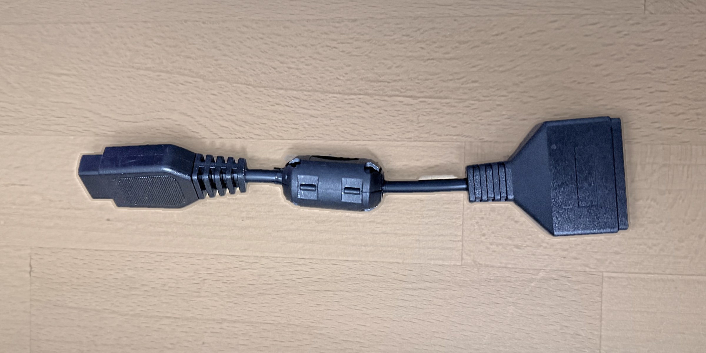

## PCB (Gerber)

Em junho de 2025, passei a me interessar cada vez mais por eletrônica e retro consoles. Por isso, criei no [EasyEDA](https://easyeda.com/) o projeto de uma [PCB](https://es.wikipedia.org/wiki/Circuito_impreso) com a pinagem que converte NES para Geniecom, para fabricá-la na [JLCPCB](https://jlcpcb.com/). A placa mede aproximadamente 31 × 40,5 mm.

Os arquivos estão disponíveis para quem quiser usar ou modificar:

| Arquivo | Descrição |
| --- | --- |
| [hardware/gerber_geniecom.zip](hardware/gerber_geniecom.zip) | Gerber, pronto para enviar à fábrica de PCB |
| [hardware/easyeda/geniecom_pcb.json](hardware/easyeda/geniecom_pcb.json) | Layout da PCB, arquivo-fonte editável (importe no EasyEDA) |
| [hardware/easyeda/geniecom_sch.json](hardware/easyeda/geniecom_sch.json) | Esquemático, arquivo-fonte editável (importe no EasyEDA) |
| [hardware/easyeda/geniecom_pcb.pdf](hardware/easyeda/geniecom_pcb.pdf) | Visualização do layout |
| [hardware/bom.csv](hardware/bom.csv) | Lista de materiais (BOM) |

Façam bom proveito!

### Lista de materiais

| Designador | Descrição | Qtd. | Compra |
| --- | --- | --- | --- |
| NES | Conector de controle NES, 7 pinos fêmea, ângulo reto | 1 | [AliExpress](https://www.aliexpress.com/item/32828024202.html) |
| Geniecom | Conector DB9 fêmea, ângulo reto | 1 | [AliExpress](https://www.aliexpress.com/item/4001214300548.html) |

### Ligações da PCB

A PCB implementa a [correlação Geniecom ↔ NES](#correlação-geniecom--nes) acima.

> **Nota sobre o EasyEDA:** o footprint do DB9 fêmea usado no projeto tem os pads numerados de forma espelhada em relação aos pinos físicos (pad 1 ↔ pino 5, pad 2 ↔ pino 4, pad 6 ↔ pino 9 e pad 7 ↔ pino 8; o pad 3 coincide). Por isso, o esquemático e o layout mostram, por exemplo, "DB9 1 → NES 4", que corresponde ao Data (pino físico 5) no NES. Se você editar o projeto, mantenha esse espelhamento.

### PCB montada

A placa chegou e foi montada com os dois conectores.

| | |
| --- | --- |
| 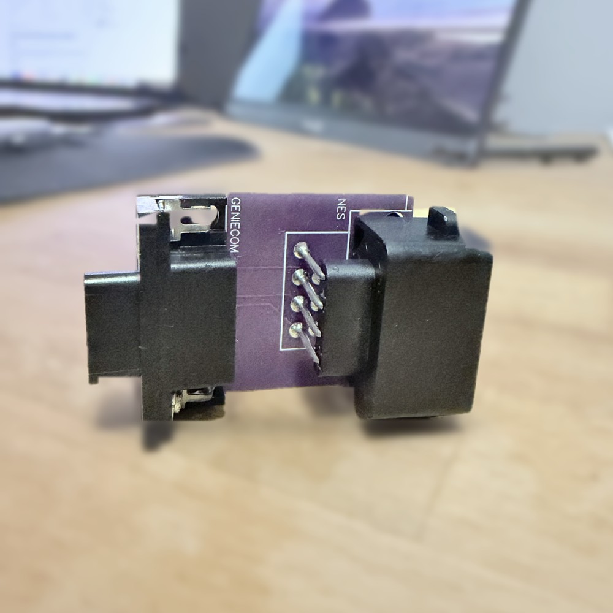 | 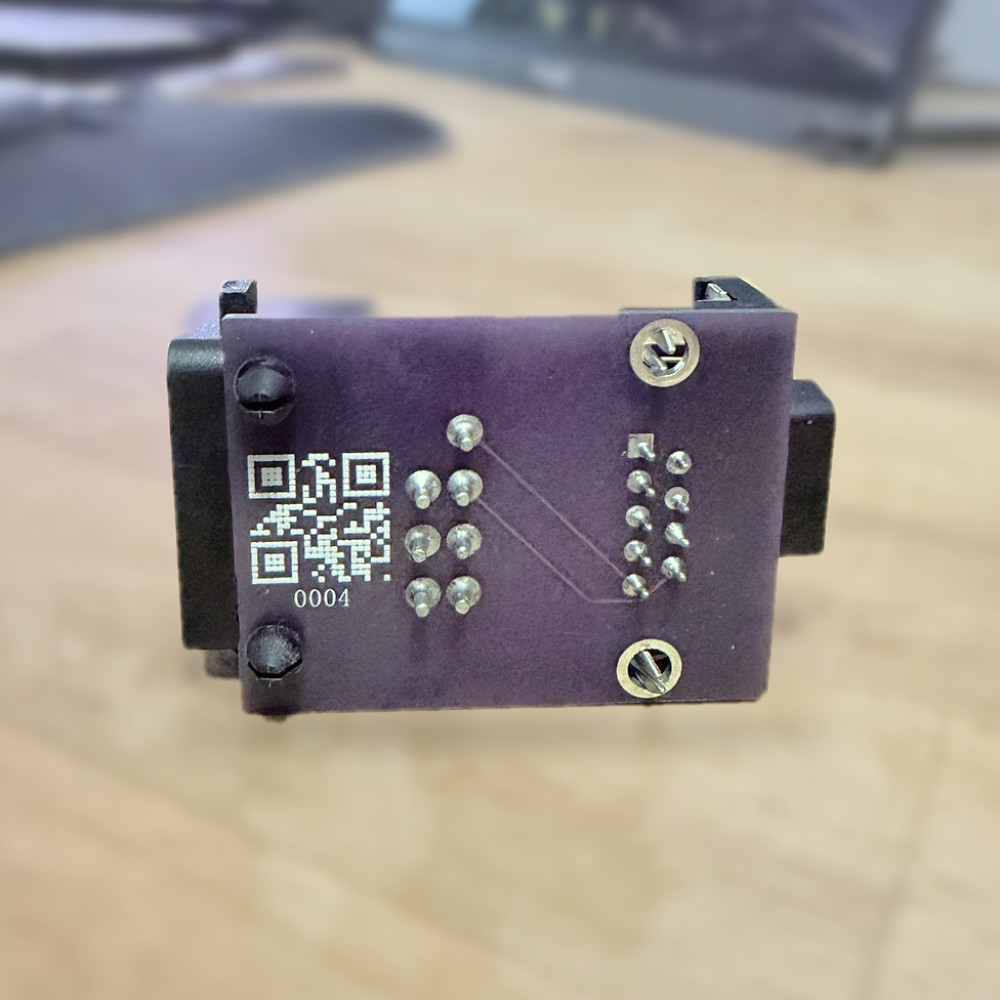 |
| Vista geral: conector DB9 (lado Geniecom) e conector NES. | Verso da placa, com os terminais dos conectores. |
| 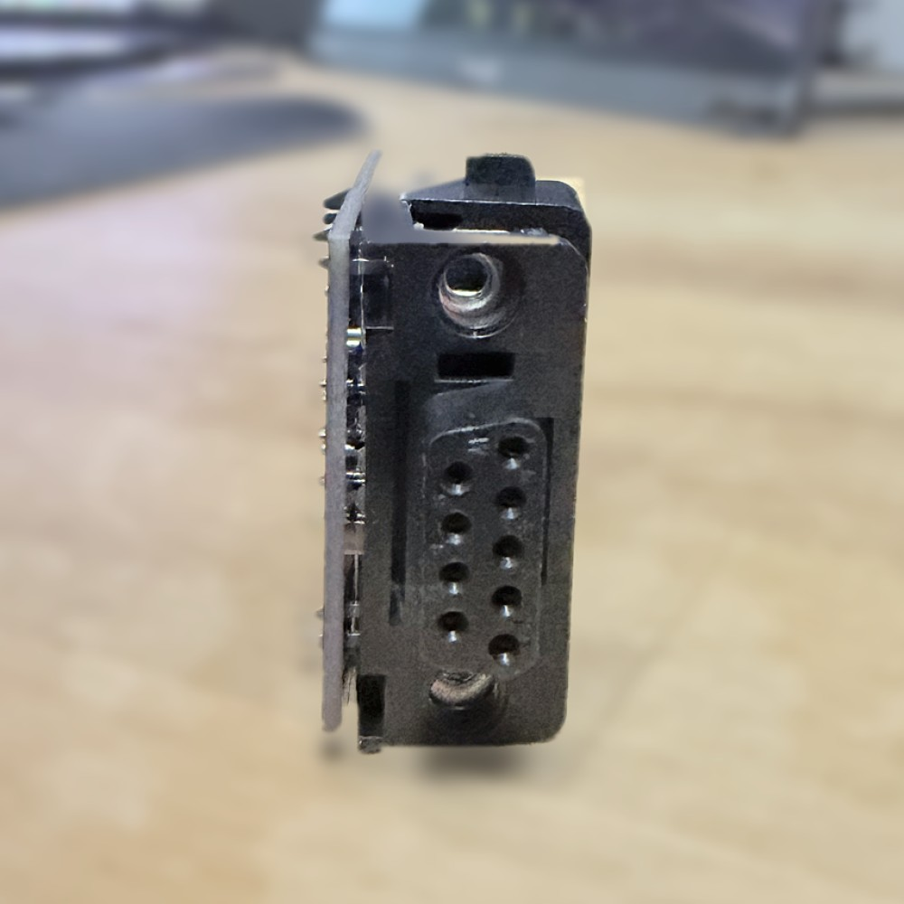 | 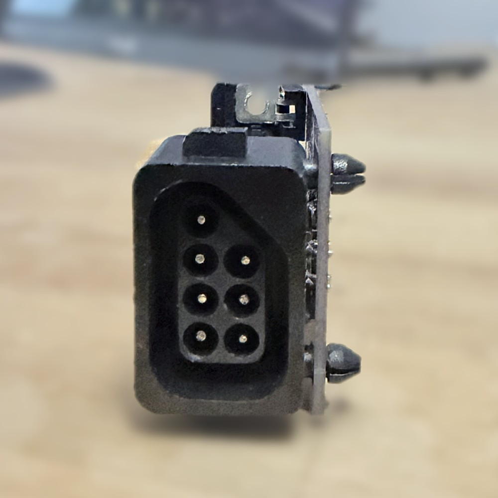 |
| Conector DB9 fêmea, que encaixa no Geniecom. | Conector NES de 7 pinos, que recebe o controle ou o Retro Receiver. |

## Bônus: outros clones

Pinagem dos demais clones que consegui coletar:

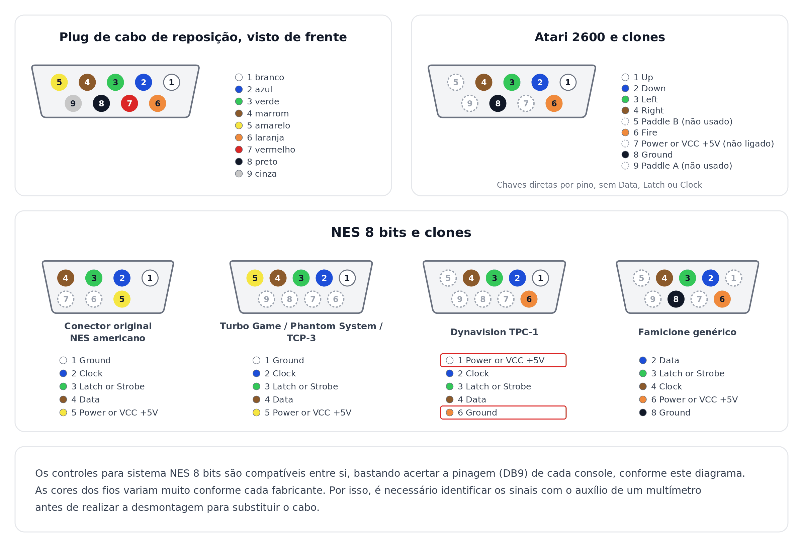

## Estrutura do repositório

```text
.
├── README.md                  # Este arquivo
├── LICENSE
├── .gitignore
├── docs/
│   ├── historia.md            # Motivação, busca pela pinagem e agradecimentos
│   └── img/                   # Diagramas de pinagem e fotos do adaptador
│       └── pcb/               # Fotos da PCB montada
└── hardware/
    ├── gerber_geniecom.zip    # Arquivos Gerber da PCB
    ├── bom.csv                # Lista de materiais
    └── easyeda/
        ├── geniecom_sch.json  # Esquemático (EasyEDA)
        ├── geniecom_pcb.json  # Layout da PCB (EasyEDA)
        └── geniecom_pcb.pdf   # Visualização do layout
```

## Créditos

- [Lucas Guilherme](https://shopee.com.br/shop/353762657), que documentou a pinagem do Geniecom.
- [Ícaro Jonas](https://github.com/icaroj), que converteu o Geniecom para NTSC e confeccionou os adaptadores.

Mais detalhes em [docs/historia.md](docs/historia.md#agradecimentos).

## Licença

Distribuído sob a [GNU GPL v3](LICENSE).
